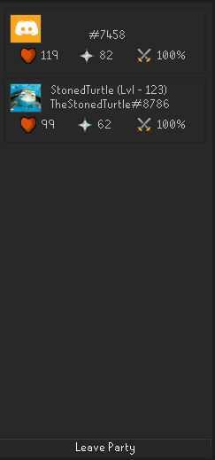
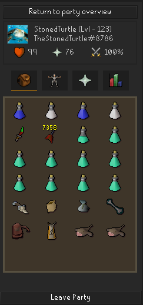
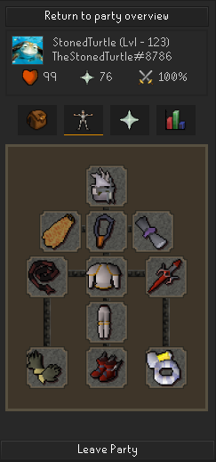
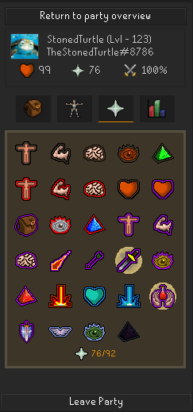
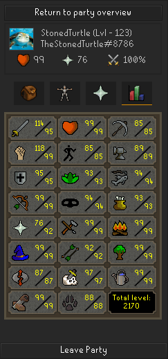

# Party Panel
Adds a side panel that displays useful information about your discord party members who are also using this plugin.

# Using the plugin
This plugin requires the  to be enabled and is compatible with the  but does not require it. I would recommend keeping the Party plugin enabled and disabling the `Stats` option to remove the in-game overlays.

To learn more about joining a party please read the  about this.

# UI Examples

